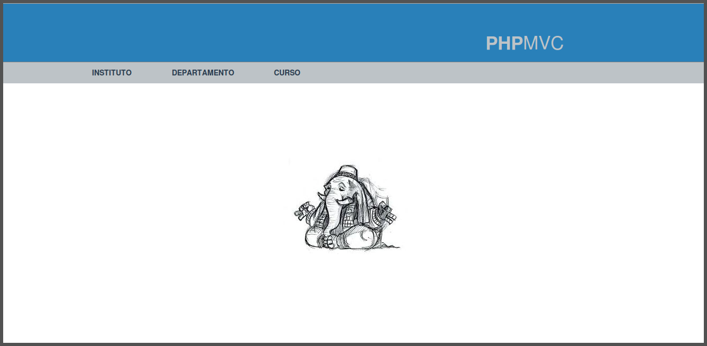
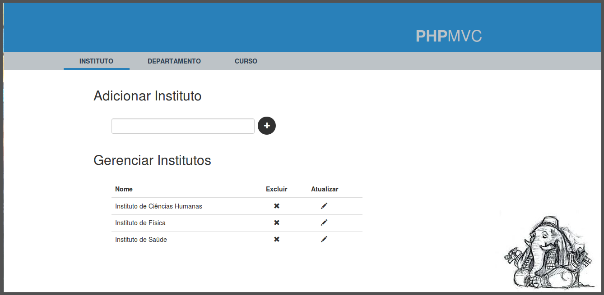
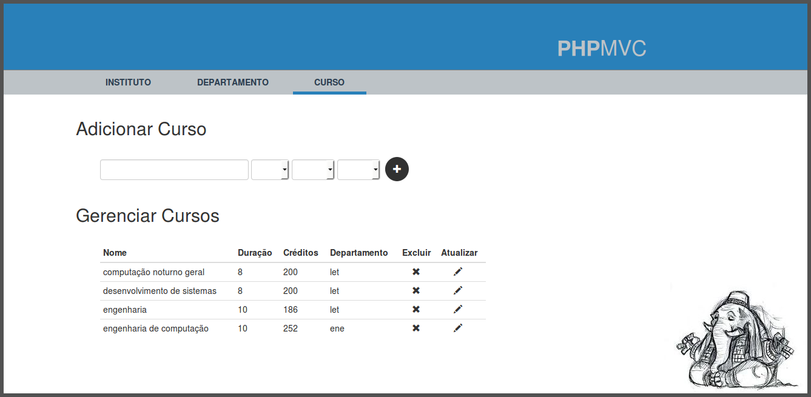

# php-mvc
Web app que implementa um crud básico utilizando php com arquitetura mvc e sem frameworks.
https://github.com/martinso-alex/php-mvc
Modelagem Física (mysql workbench):

Index:

Institutos:

Departamentos:

Cursos:

#Explicação da Arquitetura

Trata-se de uma estrutura mvc (model-view-controller que corresponde às camadas de persistência, interface e controle, respectivamente).

As páginas index.php chamam [arquivos javascript](mvc/controller/js).

Esses por sua vez fazem requisições via ajax para a [camada de controle](mvc/controller), passando como parâmetros na requisição dados relevantes, de acordo com as interações do usuário.

Na camada de controle, são feitas chamadas à [camada de persistência](mvc/model/service) quando necessário. Os dados colhidos são então enviados aqui para a [camada de interface](mvc/view), que renderiza a interface do CRUD a partir dos dados fornecidos. A camada de controle, então, retorna essa interface para o javascript inicial que manipula o DOM de forma assíncrona, exibindo-a.

Na camada de persistência temos uma [subcamada de serviço](mvc/model/service), onde ficariam as eventuais regras de negócio e temos a [subcamada DAO](mvc/model/dao) (data access object). Na camada DAO utilizamos as [classes que mapeiam as entidades do banco de dados](mvc/model/classes) e a [classe de conexão](mvc/model/ConnectionUtil.php), que realiza a execução das queries SQL. Com ambas essas classes, a camada DAO realiza as operações do CRUD, retornando um array de objetos do banco quando necessário (esse array é o que será passado à camada de interface por intermédio da de controle).

Na camada de interface, é esperado que os dados extraídos do banco sejam passados como parâmetro na forma de array de objetos. Com esse array, um pedaço da interface em html é criado e armazenado em uma váriável. Essa variável é retornada para a camada de controle, que a retorna para o javascript inicial, que a exibe de forma assíncrona.
