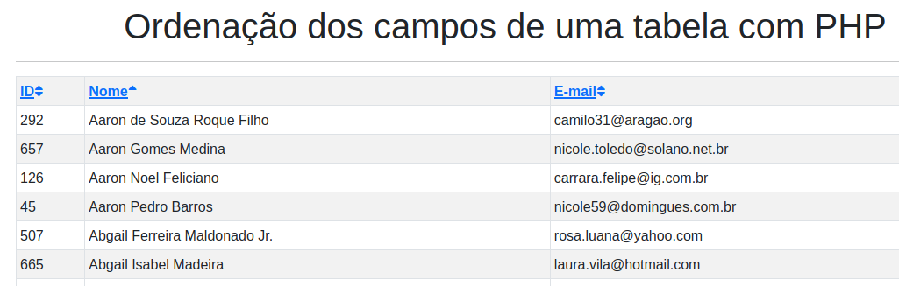

# Ordenação das colunas de uma tabela em PHP

Sem complicações, usando somente PHP

Em três versões:

- Uma usando a conexão mysqli

- Outra usando a conexão tipo PDO

- E outra usando PDO com bootstrap 4

Experimentar um demo online no 000webhost

https://ribamarfs.000webhostapp.com/sort/

## Captura

Grato ao cara que criou o original e compartilhou:

https://codeshack.io/how-to-sort-table-columns-php-mysql/

